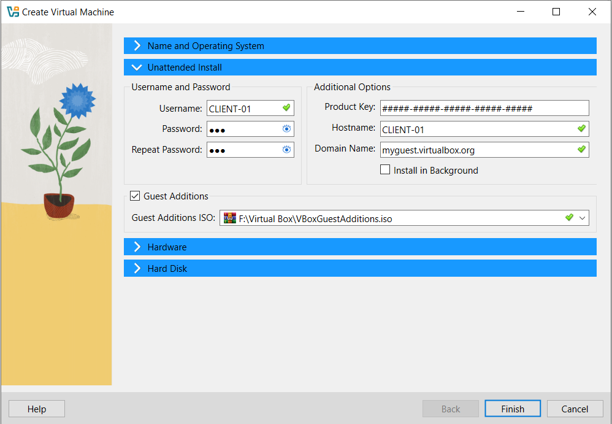

# Simulated Active Directory Domain Controller Infrastructure using VirtualBox Offline

## 1. Windows Server Evaluation and Windows 10 Enterprise Evaluation Installation
  In the **Virtual Machine (VM)**, **select** the **Create Virtual Machine** icon (often a `+` or 'New' button depending on the VirtualBox version) to start the installation process. On the installation page. 
  **Enter** `DC-SERVER` as the **Name** for the VM.
  **Choose** the desired folder for the installation location (e.g., `F:\Virtual Box`).
  In the **ISO Image** section, **select** your Windows Server ISO file
  **Click** **'Next'** to proceed.

In this step, **enter** you desired **Username and Password**, then confirm the **Guest Additions** checkbox is checked. **Click next** to proceed

For this step, configure the **VM Base memory** to `3048 MB` and allocate `1` **CPU** click next to proceed

On this page, set the **Disk Size** for your virtual hard disk, **Click Next** to proceed

Wait for the installation to finish

After the installation is complete, you will be able to access the Windows Server desktop.

For Windows 10 installation, follow the same steps, with the following setting: 
VM Name`Client-01`
Base Memory  `2048 MB`
Processor count `1`
Virtual Storage `30GB`

## 2. Configure VirtualBox Network
On the Virtualbox Manager select `File` > `Tools` > `Network Manager`.
On the **VirtualBox Host-Only Network Details** page select `VirtualBox Host-Only Ethernet Adapter` then click the **Properties** 

Click **DHCP Server** tab then uncheck the **Enable Server** checkbox to disable DHCP

Next go to the adapter tab set the **IPv4 Address** to `192.168.56.1` and **IPv Network Mask** to `255.255.255.0`

Return to the main Virtual Box Manager page. For both the **Windows Server and Windows 10** go to their respective VM setting then navigate to the network section, In the network settings configure **Adapter 1** to be **NAT**

For Adapter 2 check the Enable Network Adapter checkbox, and set “Attached to” to **Host only Adapter**

## 3. Configure IP for Windows Server
To configure IP for Windows Server navigate to `Control Panel` > `Network and Internet` > `Network and Sharing Center` > `Change adapter settings`. Then select `Adapter 2` right-click and choose **Properties** and Select **Internet Protocol Verision 4**

After choosing **Internet Protocol Version 4 (TCP/IPv4)**, go to its properties. Check **Use the following IP address** and set the **IP address** to `192.168.56.10`, **Subnet mask** to 255.255.255.0, and **Default gateway** to `192.168.56.1`. Next, check **Use the following DNS server addresses** and configure the **Preferred DNS server** as `127.0.0.1`.

After configuring the IP for Windows Server, verify the configuration by opening **Command Prompt** and type **ping 192.168.56.1**. if successful, the Windows Server will receive replies from `192.168.56.1`

## 4. Install and Configure Active Directory Domain Services (AD DS) and DNS
To begin, open **Server Manager** from the Start menu. In *Server Manager*,select **Add Roles and Features**

After choosing **Add Roles and Features** the installation wizard will launch. On the **Installation Type** screen, select Role-based or feature-based installation** and click Next to proceed

On the **Server Selection** page, check **Select a server from the server pool**.then, select the local server and click Next to continue.

On the **Server roles** page, choose `Active Directory Domain Services` and `DNS Server`. Continue by clicking Next through the subsequent prompt until the installation progress begin.

Wait until the installation process is complete

Once the installation is complete, click the **flag icon** and select **Promote this server to a domain controller**

On the **Deployment Configuration** step in the AD DS Configuration Wizard, **select** **Add a new forest**.
**Provide a name** for your **Root domain name** Click next to continue.
 

On the **Domain Controller** page, provide a password **for Directory Services Restor Mode (DSRM)** Click Next through the remaining steps until the installation is complete. Finally **Restart** the Windows Server to apply the settings.
 

## 5. Join Domain (Client)
On the Windows 10 client, set the following IP configuration:  
***IPv4 Address:** `192.168.56.11`
    * **Subnet mask:** `255.255.255.0`
    * **Default gateway:** `192.168.56.1`
    * **Preferred DNS server:** `192.168.56.10` 
    then click Apply once configured

After configuring the IP address for windows 10, go to the search bar and type **System**, then open the **System** settings

On the **System** settings page, select **Advanced system** settings’.

In the **System Properties** windows, navigate to the **Computer Name** tab and click **Change** button.

In the ‘Computer **Name/Domain Changes** select the **Domain radio button** and Enter the Windows Server domain name,Then click **OK** to proceed

Enter the domain administrators username and password to join the domain.

If successful, a notification will confirm that the client has joined the domain, and prompted to restart Windows 10

## 6. Create OU (Organizational Unit) and User in Active Directory

Search **Active Directory Users and Computers** in Windows server and open the application/

Once **Active Directory Users and Computers** is open, navigate to domain name

Rigt-click on domain then select `New` > `Organizational Unit`. **Provide a name** for the OU, for example `OU-ITSupport`.. Click **OK** to create the OU

Right-click on the newly created **OU-ITSupport**. Select `New` > `User`.

Fill the in the column for the **First name**, **Lastname**, **Fullrname** and **User logon name**. Click Next to proceed. **Set** the user password and select desired password options.

 **Click Finish** to create the new user account 

## 7. Create Shared Folder on Server

On the Windows Server, **create** a new folder on the `C:\` drive and name the `ShareDocs`

Right click on the `ShareDocs` navigate to `Properties` > `Sharing` > `Advanced Sharing`., check **Share this Folder**
 

Click the **Permissions** and add the domain user who should have access.**Grant** then appropriate permissions. Ensure the **Windows 10 (Client)** has the necessary permissions to access this folder

### Access from Client
Login in to the **Windows 10 (Client)** using a domain user account.

Open File Explorer.Navigate to `\\DC-Server\ShareDocs` to verify access to the shared folder.

## 8. Configure Group Policy Objects (GPO)
On the Windowss Server, search for **Group Policy Management** and open it.

In Group Policy Management, navigate to `Forest` > `Domains` > `andrilab.local` > `OU-ITSupport` Right-click on `OU-ITSupport` and select **Create a GPO in this domain, and Link it here**. Name the new GPO ‘ITSupportPolicy’ and click **OK**

Right click on ‘ITSpportPolicy’ and select **Edit**. This will open the Group Policy Management Editor.

### Example Policy Configurations
Disable USB access:
In **Group Policy Management Editor** navigate to `Computer Configuration` > `Policies` > `Administrative Templates` > `System` > `Removable Storage Access`.
Locate and open the policy **All Removeable storage classes: Deny all access**

Select **Enabled** to disable USB access.

Disable Control Panel Access 
Navigate to `User Configuration` > `Administrative Templates` > `Control Panel`. Locate and open the policy **Prohibit access to Control Panel and PC settings**. 

Select Enable
If this policy enabled, clients will be unable to open Control Panel and Settings. 

Set Dekstop Wallpaper
Navigate to `User Configuration` > `Administrative Templates` > `Desktop` > `Desktop`. open the policy **Dekstop Wallpaper**.

Select enabled in the **Wallpaper name** field,  enter the network path to your wallpaper file and then click **OK**.

Activating GPO on the Client
On the windows 10 (Client) search and open **Commad Prompt** as administrator.

Type `gpupdate /force` and press **Enter** to apply the new Group Policy

If the commands is successful, a notification will appear confirming the policy update and then **restart** Windows 10 (Client)

Let see the policy has been updated if the wallpaper not show copy file wallpaper to Client (ensure it's accessible via the network path)
Try open **Control Panel** it should  show restrictions for accessing it (Optional: Test USB access if applicable

## 9. Basic Monitoring and Event Viewer
**Attempt to log in** to Windows 10 (Client)

On Windows Server,open **Event Viewer** to monitor login attempts.  
    * A successful login attempt is logged with **Event ID `4624`**.
    * A logoff event is logged with **Event ID `4634`**.
    * A failed login attempt is logged with **Event ID `4625`** 
    Monitoring these events can help identify **Unauthorized access** or **Data breach** attempts.

